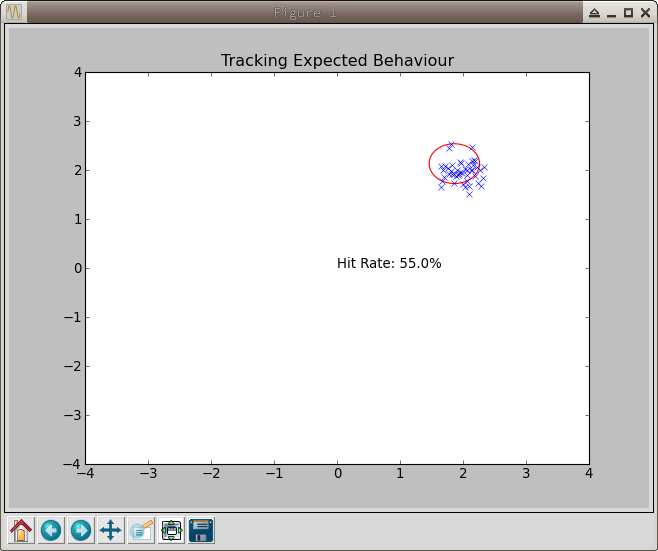

# Novelty Detection

This script mocks up the use of a simple model novelty detection system to identify when a system starts to behave differently.

Based on: [scikit-learn:svm](http://scikit-learn.org/stable/auto_examples/svm/plot_oneclass.html#example-svm-plot-oneclass-py)



## Logic Flow

1. Start with an empty environment.
2. Collect data points to be used in training the model about expected behaviour.
3. Create a model that defines a boundary around expectant behaviour.
4. As new data points come in calculate whether they are inside the modeled boundary or not.
5. Keep a hit moving average (Number of hits in the boundary / Number of points in the moving window)
6. If the hit rate is:
    * above a set threshold (default = 30%), loop back to step 4.
    * above a set threshold (default = 30%), the system behaviour no longer matches the model. Continue to step 7.
7. At this point you can have alerts or some other logging built in that

## Run

```python
python novelty_detector.py
```

## Requirements

```bash
pip install numpy==1.7.1
pip install scipy==0.11.0
pip install scikit-learn==0.13.1
pip install matplotlib==1.2.1
```
